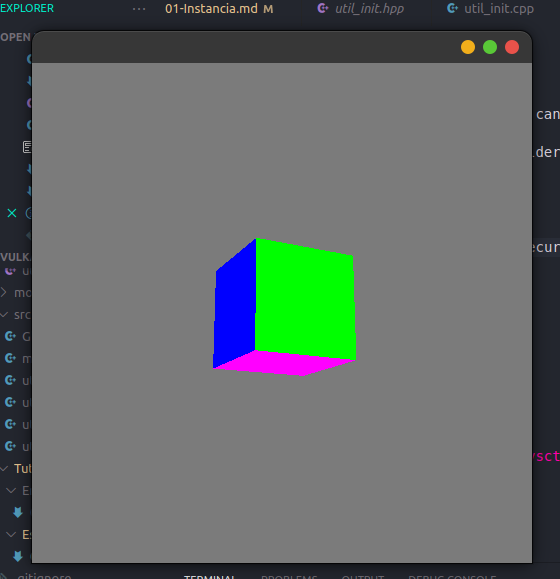

# Vulkan Cube

Not working on Windows yet, but you can test it and add the missing libraries for the windows part

Documentation is in the Tutorial folder

# Building
On terminal

    git submodule update --init --recursive
    mkdir build
    cmake -S . -B build
    make -C build

# Running
On terminal

    ./build/vulkan

# On Linux you may need to modify sysctl file
    
On terminal
    
    sudo gedit /etc/sysctl.conf

It will open gedit

Add the following line at the end of file and save it
    
    dev.i915.perf_stream_paranoid=0

On terminal type this to apply changes

    sudo sysctl -p

# Screenshot

